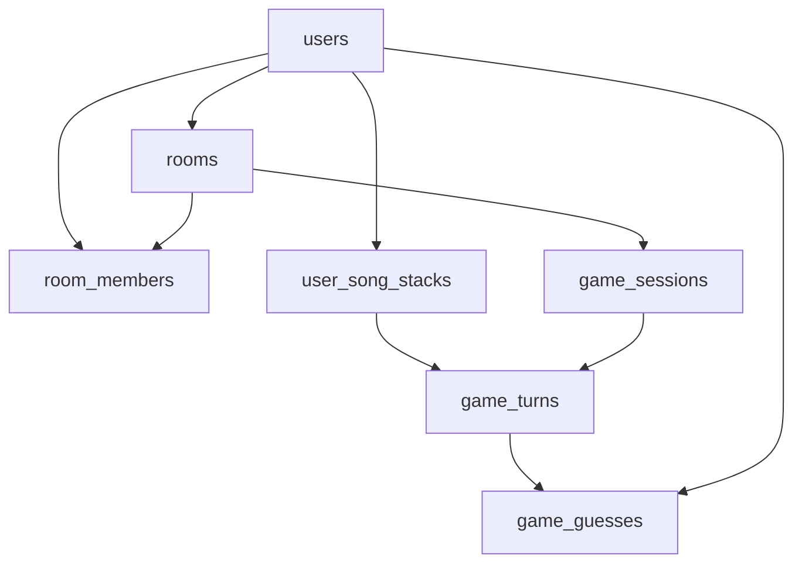

# Game Session & Song Stack Implementation

## 🎯 **Overview**
This implementation adds database-backed session management and song storage to Shotobump, with a key focus on **host-controlled audio** for real-world board game scenarios.

## 🏗️ **Architecture**

### **Database Schema**
- **`user_song_stacks`** - Store player song collections per room
- **`game_sessions`** - Track game state with designated host
- **`game_turns`** - Individual turn management with audio control
- **`game_guesses`** - Player guesses for each turn

### **Key Services**
- **`SongStackService`** - Manage user song collections
- **`GameSessionService`** - Handle game sessions and host permissions

## 🎵 **Host-Controlled Audio Design**

### **Why Host Controls Audio?**
In real board game nights, one person's phone is connected to the speaker system. This implementation ensures:
- Only the room creator (host) can control audio playback
- Prevents multiple audio streams or conflicts
- Matches real-world usage patterns

### **Audio Control Flow**
1. **Game Creation**: Only host can create and start game sessions
2. **Turn Management**: Host controls when audio plays/pauses/repeats
3. **Permission Checks**: Database policies enforce host-only audio control
4. **State Sync**: All players see audio state but can't modify it

## 🎮 **Game Flow**

### **Pre-Game Setup**
1. Players join room using room code
2. Each player builds their song stack via Spotify search
3. Host verifies all players have songs before starting

### **Game Session Creation**
```typescript
// Only host can create game sessions
const gameSession = await gameSessionService.createGameSession(roomId, hostId);
```

### **Turn-Based Gameplay**
1. **Audio Phase**: Host plays song (up to 3 times)
2. **Guessing Phase**: Players submit guesses
3. **Voting Phase**: Players vote on correct answers
4. **Results Phase**: Points awarded/deducted
5. **Next Turn**: Rotate to next player's song

## 🔐 **Security & Permissions**

### **Row Level Security (RLS)**
- Users can only modify their own songs
- Room members can view all songs in their room
- Only hosts can control game sessions and audio
- Players can only submit guesses for games they're in

### **Host Verification**
```typescript
// Audio control requires host verification
async updateAudioControl(turnId: string, hostId: string, audioControl: AudioControl) {
  // Verify user is the game host before allowing audio changes
  const turn = await fetchTurnWithGameSession(turnId);
  if (turn.game_session.host_id !== hostId) {
    throw new Error('Only the host can control audio playback');
  }
  // Update audio state...
}
```

## 📱 **User Interface**

### **Song Stack Management**
- Spotify-style green gradient design
- Search and add songs from Spotify
- View and manage personal song collection
- Real-time database sync

### **Room Screen Enhancements**
- Game session status display
- Host-only start game controls
- Player readiness validation
- Real-time game state updates

### **Game State Indicators**
- **Waiting**: Players preparing song stacks
- **Playing**: Active game session
- **Host Controls**: Special UI for audio management

## 🚀 **Implementation Status**

### ✅ **Completed Features**
- Database schema with proper relationships
- Song stack management with Supabase integration
- Game session creation and host validation
- RLS policies for security
- UI integration in Room and SongStack screens
- Mock data support for development

### 🔄 **Next Steps**
1. **Real Spotify API Integration**
   - Replace mock search with actual Spotify API
   - Implement OAuth token refresh
   
2. **Gameplay Screen**
   - Audio player for host controls
   - Guess submission interface
   - Voting system UI
   
3. **Real-time Updates**
   - Supabase real-time subscriptions
   - Live game state synchronization
   
4. **Scoring System**
   - Point calculation logic
   - Leaderboard display

## 🎵 **Audio Control Details**

### **Host-Only Controls**
```typescript
interface AudioControl {
  is_playing: boolean;
  play_count: number;      // Track repeats (max 3)
  max_plays: number;       // Configurable limit
  current_position: number; // Playback position
  started_at?: string;     // Timing tracking
}
```

### **Player Experience**
- **Host**: Full audio controls (play/pause/repeat)
- **Players**: View-only audio state, focus on guessing
- **All**: Real-time sync of audio status

## 🔧 **Development Setup**

### **Database Setup**
```bash
# Run the schema update
psql -h [supabase-host] -d [database] -f database-schema-update.sql
```

### **Environment Variables**
```env
EXPO_PUBLIC_SUPABASE_URL=your_supabase_url
EXPO_PUBLIC_SUPABASE_ANON_KEY=your_anon_key
EXPO_PUBLIC_SPOTIFY_CLIENT_ID=your_spotify_client_id
```

### **Testing**
- Use mock users for multiplayer testing
- Mock data fallback when Supabase unavailable
- Development-only login buttons for testing

## 📊 **Database Relationships**



This implementation provides a solid foundation for multiplayer music recognition gameplay with proper host controls and database persistence. 